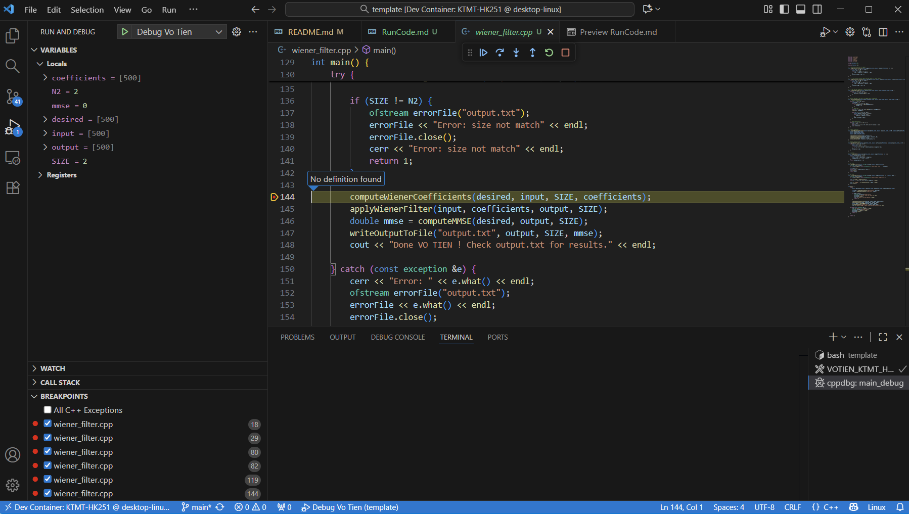

# ⚙️ 1. Chạy chương trình C++

```bash
g++ -o main wiener_filter.cpp
./main
```

**Nếu chương trình đọc dữ liệu từ file:**
- Đặt file `input.txt`, `desired.txt` cùng thư mục với main
- File đầu ra sẽ được ghi vào `output.txt`

# 🧪 2. Chạy kiểm thử Python (pytest)

```SH
# ALL TEST
pytest -v test_wiener_filter.py

# ONE TEST
pytest -v test_wiener_filter.py::test_001
```

Tệp **`test_wiener_filter.py`** sẽ:

1. **Đọc dữ liệu đầu vào** từ ba tệp `input.txt`, `desired.txt`, và `result.txt`.
2. **Gọi hàm thực thi bộ lọc Wiener** được hiện thực trong `wiener_filter.cpp` (hoặc thông qua module Python tương ứng).
3. **Tạo tệp `output.txt`** chứa kết quả thực tế tính được.
4. **So sánh nội dung `output.txt` với `result.txt`**:

   * Nếu khớp (sai số trong ngưỡng cho phép) → test **PASSED**
   * Nếu khác → test **FAILED**, và pytest hiển thị giá trị lệch.

# 🐞 3. Debug chương trình C++ https://code.visualstudio.com/docs/cpp/cpp-debug


