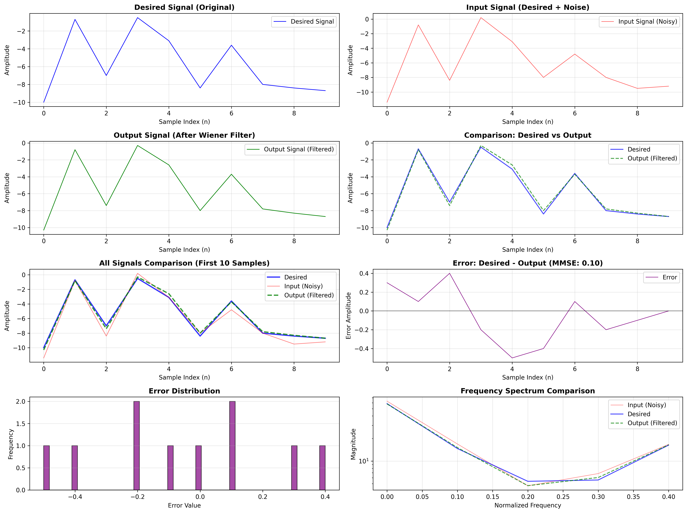

# ⚙️ **1. Chạy chương trình C++**

### 🧩 Biên dịch và chạy thủ công:

```bash
# Biên dịch
g++ -o main wiener_filter.cpp

# Chạy chương trình
./main
```

### 🧪 Chạy toàn bộ test:

```bash
pytest -vv test_c.py
```

### 🧾 Chạy một test cụ thể:

```bash
pytest -vv test_c.py::test_001
```

---

# ⚙️ **2. Chạy chương trình MIPS**

### 🧩 Chạy thủ công bằng Mars:

```bash
java -jar Mars45.jar nc wiener_filter.asm
```

### 🧪 Chạy toàn bộ test:

```bash
python3 -m pytest test_misp.py
```

### 🧾 Chạy một test cụ thể:

```bash
python3 -m pytest test_misp.py::test_001
```

---

# Mô Tả Test Case

| 🧩 **Tên test case** | 📝 **Mô tả**                                                                                                                                                                        |
| -------------------- | ----------------------------------------------------------------------------------------------------------------------------------------------------------------------------------- |
| **test_001**         | Trường hợp cơ bản với tín hiệu ngắn:<br> ( d = [2.0, 3.0] ), ( x = [2.5, 2.8] ). Dùng để kiểm tra tính chính xác của bộ lọc khi dữ liệu chỉ có 2 mẫu.                               |
| **test_002**         | Trường hợp cơ bản với tín hiệu dài hơn:<br> ( d = [1.5, 2.8, 3.2] ), ( x = [1.2, 2.5, 3.0] ). Dùng để đánh giá bộ lọc với dữ liệu 3 điểm và kiểm chứng tính ổn định của thuật toán. |
| **test_003**         | Trường hợp cơ bản với tín hiệu ngắn:<br> ( d = [2.0, 3.0] ), ( x = [2.5, 2.8] ). Dùng để kiểm tra tính chính xác của bộ lọc khi dữ liệu chỉ có 2 mẫu.                               |
| **test_004**         | Trường hợp cơ bản với tín hiệu dài hơn:<br> ( d = [1.5, 2.8, 3.2] ), ( x = [1.2, 2.5, 3.0] ). Dùng để đánh giá bộ lọc với dữ liệu 3 điểm và kiểm chứng tính ổn định của thuật toán. |
| **test_005**         | Sóng sin với nhiễu trắng (White Noise):<br> ( d ) là sóng sine với tần số 0.05, biên độ 1.0 (500 mẫu), ( x = d + ) nhiễu trắng (biên độ 0.3). Kiểm tra khả năng lọc nhiễu trắng cơ bản, kỳ vọng MMSE < 0.1. |
| **test_006**         | Sóng sin với nhiễu hồng (Pink Noise):<br> ( d ) là sóng sine với tần số 0.05, biên độ 1.0 (500 mẫu), ( x = d + ) nhiễu hồng (1/f noise, biên độ 0.3). Kiểm tra khả năng xử lý nhiễu có phổ tần phức tạp hơn nhiễu trắng. |
| **test_007**         | Sóng cosin với nhiễu trắng:<br> ( d ) là sóng cosine với tần số 0.03, biên độ 2.0 (500 mẫu), ( x = d + ) nhiễu trắng (biên độ 0.5). Kiểm tra bộ lọc với dạng sóng khác và mức nhiễu cao hơn. |
| **test_008**         | Tín hiệu hỗn hợp đa tần số:<br> ( d = sin(2π×0.05×n) + 0.5×sin(2π×0.1×n) + 0.3×cos(2π×0.02×n) ) (500 mẫu), ( x = d + ) nhiễu trắng (biên độ 0.4). Kiểm tra khả năng xử lý tín hiệu phức tạp với nhiều thành phần tần số. |
| **test_009**         | Kịch bản nhiễu thấp:<br> ( d ) là sóng sine (tần số 0.04, biên độ 1.5), ( x = d + ) nhiễu rất nhỏ (biên độ 0.05). Kiểm tra độ chính xác cao, kỳ vọng MMSE < 0.01.|
| **test_010**         | Kịch bản nhiễu thấp:<br> ( d ) là sóng sine (tần số 0.04, biên độ 1.5), ( x = d + ) nhiễu rất nhỏ (biên độ 0.05). Kiểm tra độ chính xác cao, kỳ vọng MMSE < 0.01. |
| **test_011**         | Kịch bản nhiễu cao:<br> ( d ) là sóng sine (tần số 0.05, biên độ 1.0), ( x = d + ) nhiễu lớn (biên độ 0.8). Kiểm tra khả năng làm việc trong môi trường nhiễu mạnh. |
| **test_012**         | Kịch bản nhiễu cao:<br> ( d ) là sóng sine (tần số 0.05, biên độ 1.0), ( x = d + ) nhiễu lớn (biên độ 0.8). Kiểm tra khả năng làm việc trong môi trường nhiễu mạnh. |
| **test_013**         | Kịch bản nhiễu cao:<br> ( d ) là sóng sine (tần số 0.05, biên độ 1.0), ( x = d + ) nhiễu lớn (biên độ 0.8). Kiểm tra khả năng làm việc trong môi trường nhiễu mạnh. |
| **test_014**         | Kiểm tra định dạng đầu ra khi size của input và desired không match |

---

# Plot Kết Quả

```
root@b3c0543f46ce:/workspaces/template# python3 create_plot.py 
Desired signal: 10 samples
Input signal: 10 samples
Output signal: 10 samples
MMSE: 0.10

Đã lưu đồ thị vào file: wiener_filter_analysis.png
```



Khi chạy testcase, plot sẽ xuất hiện trong thư mục của testcase đó. Hoặc có thể dùng lệnh `python weiner_filter_plot.py` để plot. Lưu ý: lệnh này sẽ lấy 3 file input.txt, desired.txt, expect.txt trong cùng thư mục của nó.

